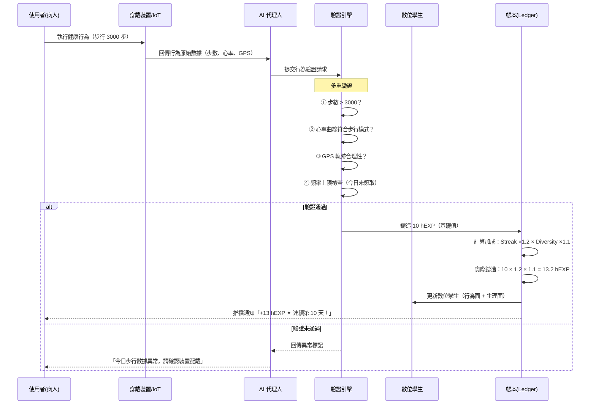
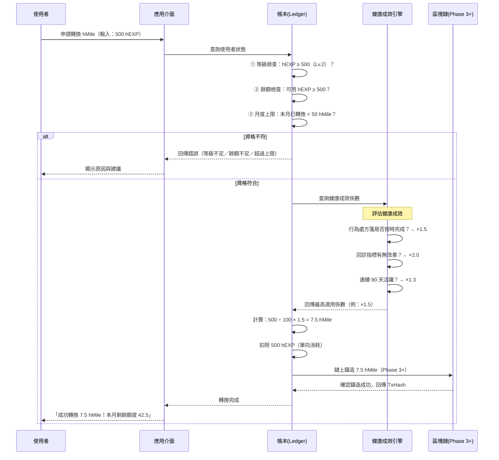
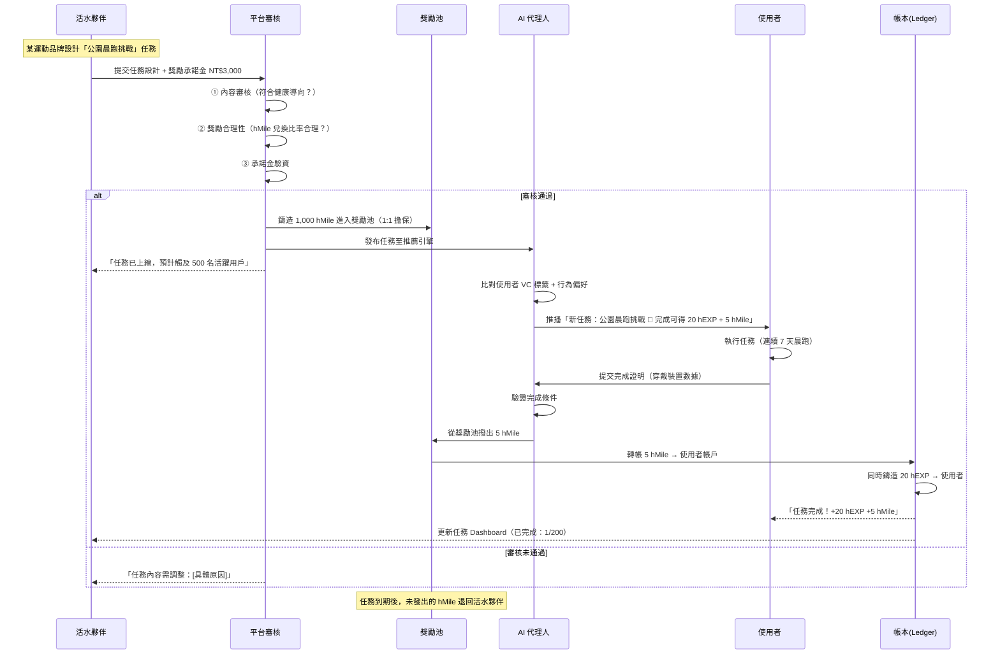
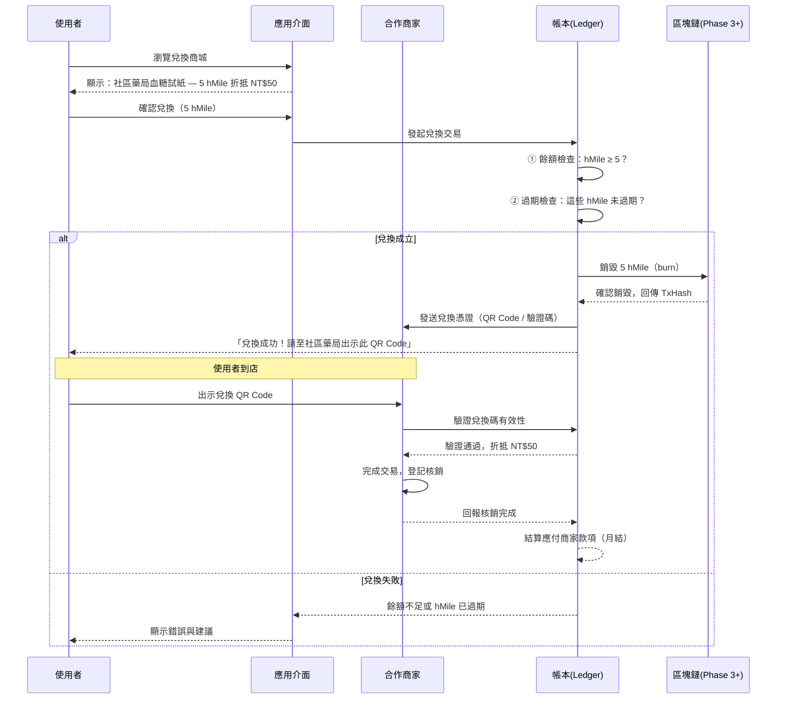
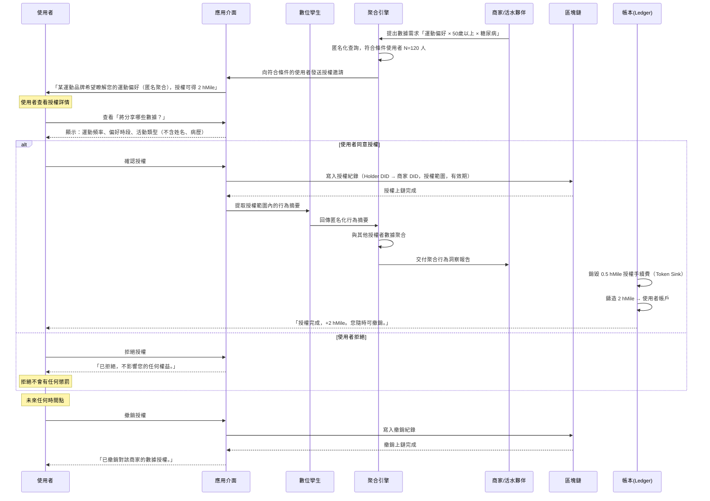
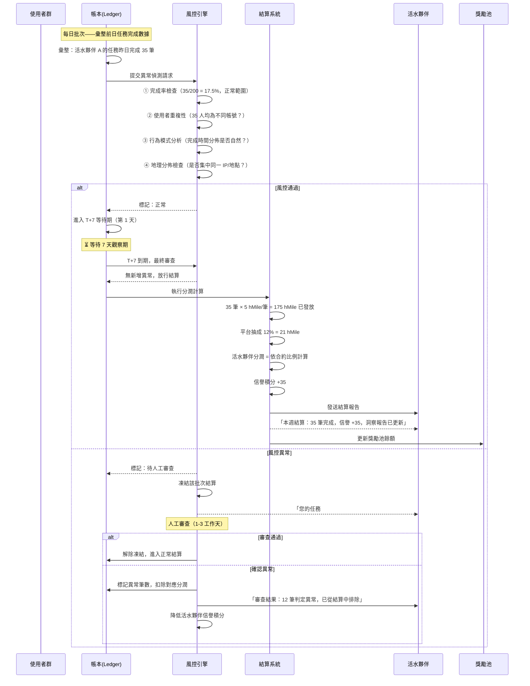

# Project SYNC — 代幣經濟白皮書

## hEXP / hMile 雙幣健康經濟系統設計

---

> **設計原則：健康不是可以被炒作的商品，但健康行為是可以被獎勵的勞動。**
>
> 本代幣經濟系統的目標不是創造一個投機市場，而是建構一個讓「做對自己身體好的事」能被看見、被驗證、被回報的行為經濟基礎建設。

---

## 1. 雙幣架構總覽

Project SYNC 採用雙幣分離設計，刻意區隔「投入度量測」與「價值流通」兩個層次，避免單一代幣同時承載聲譽與交易功能所導致的激勵扭曲。

```
                     行為投入
                        │
                        ▼
               ┌────────────────┐
               │     hEXP       │ ← 靈魂綁定層（Soulbound）
               │   健康經驗值     │    不可轉讓、不可交易
               │                │    代表「你做了多少」
               └───────┬────────┘
                       │ 達標轉換（單向閘門）
                       ▼
               ┌────────────────┐
               │     hMile      │ ← 流通價值層（Circulating）
               │   健康里程幣     │    可授權、可兌換、可追溯
               │                │    代表「你的行為值多少」
               └────────────────┘
```

**為什麼要分兩層？**

如果只有一種幣，使用者會傾向「最小成本獲取最大代幣」而非「最大化健康行為」。分離後，hEXP 是一面不會騙人的鏡子——它只反映你真實投入了多少。而 hMile 才是你能拿去換東西的資產，但它必須以 hEXP 為基礎，沒有捷徑。

---

## 2. hEXP（健康經驗值）——靈魂綁定層

### 2.1 本質定義

hEXP 是不可轉讓、不可交易的行為度量代幣（Soulbound Token）。它綁定在使用者的數位孿生上，代表其累積健康行為投入的總量與持續性。hEXP 不是資產，而是身分——你的健康履歷。

### 2.2 發行規則

每一筆 hEXP 的產生都必須對應一個可驗證的健康行為事件。系統不預鑄（pre-mint）hEXP，所有 hEXP 都是事後鑄造（mint-on-completion）。

**基礎行為產出表：**

| 行為類別 | 行為事件 | 基礎 hEXP | 驗證方式 | 頻率上限 |
|---------|---------|-----------|---------|---------|
| 運動 | 每日步行達標（3000步） | 10 | 穿戴裝置 API | 1 次/天 |
| 運動 | 社區據點運動課出席 | 20 | QR/NFC 簽到 + 時間驗證 | 1 次/天 |
| 社交 | 參加社區活動 | 15 | QR/NFC 簽到 + VC | 2 次/天 |
| 社交 | 完成病友互助任務 | 25 | 雙方確認 + AI 驗證 | 1 次/天 |
| 醫療 | 回診完成 | 30 | 健保系統對接 | 依處方週期 |
| 醫療 | 行為處方箋階段完成 | 50 | AI 綜合評估 | 依處方週期 |
| 飲食 | 每日飲食紀錄 | 5 | 自主回報 + AI 對話 | 1 次/天 |
| 學習 | 完成衛教內容 | 8 | 閱讀完成 + 小測驗 | 3 次/天 |
| 活水任務 | 完成活水夥伴任務 | 12-40 | 依任務完成條件 | 依任務設定 |

### 2.3 加成機制（Multiplier）

為了獎勵「持續參與」而非「偶爾衝量」，hEXP 採用連續行為加成：

```
實際 hEXP = 基礎 hEXP × 連續天數加成 × 行為多樣性加成

連續天數加成（Streak Multiplier）：
  1-7 天連續：   ×1.0
  8-14 天連續：  ×1.2
  15-30 天連續： ×1.5
  31-60 天連續： ×1.8
  61+ 天連續：   ×2.0（上限）

行為多樣性加成（Diversity Multiplier）：
  當日只做 1 類行為：×1.0
  當日做 2 類行為：  ×1.1
  當日做 3 類行為：  ×1.2
  當日做 4+ 類行為： ×1.3（上限）
```

**設計意圖：** 一個每天只走路但持續 60 天的病人，和一個偶爾走路但同時社交、飲食紀錄、學習的病人，系統都給予正向回饋。健康不是單一維度的事。

### 2.4 衰減機制（Decay）

hEXP 不是永久累積的。如果使用者停止參與，hEXP 會隨時間衰減，反映「健康是需要持續維護的狀態」這一核心理念。

```
衰減規則：
  停止活躍後第 1-7 天：  不衰減（寬限期）
  停止活躍後第 8-14 天： 每日衰減 1% 總量
  停止活躍後第 15-30 天：每日衰減 2% 總量
  停止活躍後第 31+ 天：  每日衰減 3% 總量

  最低保底：hEXP 不會衰減至歷史最高值的 20% 以下
            （承認過去的努力，但鼓勵回歸）
```

**保底設計的用意：** 一個曾經非常活躍但因住院或生活變故中斷的病人，回來時不會從零開始。20% 保底等於一個「記憶」——系統記得你曾經努力過。

### 2.5 等級門檻

hEXP 累積值決定使用者的數位孿生等級，等級影響可使用的功能與 hMile 轉換權限：

| 等級 | 需要 hEXP | 累積約需 | 解鎖能力 |
|------|----------|---------|---------|
| Lv.1 入門者 | 0 | — | 基礎任務接取 |
| Lv.2 行動者 | 500 | ~2-3 週持續參與 | 開通數位孿生、hMile 轉換權 |
| Lv.3 實踐者 | 2,000 | ~2 個月持續參與 | 病友互助任務建立權、社交功能 |
| Lv.4 倡議者 | 5,000 | ~4 個月持續參與 | 邀請機制、進階數據洞察 |
| Lv.5 典範者 | 12,000 | ~8 個月持續參與 | 社區任務策劃權、活水夥伴推薦資格 |

---

## 3. hMile（健康里程幣）——流通價值層

### 3.1 本質定義

hMile 是可流通、可兌換、可追溯的行為行銷代幣。它不是貨幣，不是證券，而是一種「經過行為驗證的注意力憑證」——持有 hMile 的人，已經用真實的健康行為證明了自己的參與意願，商家為這份「已驗證的注意力」買單。

**法律定位：** hMile 在 Phase 1-2 為平台內點數（不涉及虛擬通貨法規），Phase 3 鏈上化後定位為「行為獎勵積點」，非金融商品。其價值來自商家兌換承諾，而非市場投機。

### 3.2 供給機制

hMile 沒有固定總量上限（非通縮代幣），但有嚴格的發行紀律。hMile 來自三個水龍頭，每個水龍頭都有流量控制：

**水龍頭一：hEXP 轉換（使用者端鑄造）**

```
轉換公式：
  hMile 鑄造量 = 可轉換 hEXP × 轉換率 × 健康成效係數

  轉換率（基礎）：100 hEXP = 1 hMile

  健康成效係數（Health Outcome Multiplier）：
    行為處方箋按時完成：  ×1.5
    回診指標有改善：      ×2.0（需醫師端數據確認）
    連續 90 天活躍：      ×1.3
    標準狀態：            ×1.0
```

**轉換限制：**
- 每人每月最多轉換 50 hMile（防止囤積與套利）
- 轉換為單向操作（hMile 不可逆轉回 hEXP）
- 需達到 Lv.2（500 hEXP）才解鎖轉換權
- 轉換消耗對應的 hEXP（類似消費，非複製）

**水龍頭二：活水夥伴注入（供給端鑄造）**

活水夥伴可以向生態系注入 hMile 作為任務獎勵，但這些 hMile 需要以實質承諾為擔保：

```
活水夥伴注入規則：
  1. 活水夥伴預先存入「獎勵承諾金」（法幣或等值商品/服務）
  2. 系統按 1:1 對應鑄造 hMile 進入獎勵池
  3. 使用者完成任務後，hMile 從獎勵池轉入使用者帳戶
  4. 未被領取的 hMile 在任務到期後退回活水夥伴

  獎勵承諾金基準匯率：
    1 hMile ≈ NT$2-5（依兌換場景浮動，由活水夥伴自訂）
```

**水龍頭三：平台營運獎勵（系統鑄造）**

用於特殊活動、冷啟動激勵、弱勢族群補貼等非常規情境：

```
系統鑄造限制：
  每月系統鑄造 ≤ 當月總流通量的 10%
  需經治理委員會核准（Phase 3 後由 DAO 機制管理）
  明確標記為「系統鑄造」，鏈上可追溯
```

### 3.3 銷毀機制（Token Sink）

hMile 的長期健康取決於「有足夠的銷毀場景」，否則通膨將稀釋其價值。銷毀（burn）發生在以下情境：

| 銷毀場景 | 機制說明 | 預估佔比 |
|---------|---------|---------|
| 商家兌換 | 使用者用 hMile 兌換商品/服務，hMile 銷毀 | 40% |
| 數據授權費 | 使用者授權行為數據時，收取少量 hMile 作為「授權手續費」銷毀 | 15% |
| 進階功能解鎖 | 特定數位孿生裝飾、進階分析報告需消耗 hMile | 10% |
| 活水夥伴工具費 | 活水夥伴使用 A/B 測試、精準投放等進階工具需消耗 hMile | 15% |
| 過期銷毀 | hMile 自鑄造日起 365 天未使用則自動銷毀 | 20% |

**過期銷毀的設計意圖：** 避免「死幣」佔據流通量統計，同時鼓勵使用者持續參與兌換循環。365 天是足夠寬裕的期限，不會造成使用者焦慮。

### 3.4 流通規則

hMile 的流通受到有意設計的限制，防止淪為投機工具：

```
允許的流動：
  ✓ 使用者 → 商家兌換（正常消費）
  ✓ 活水夥伴 → 獎勵池 → 使用者（任務獎勵）
  ✓ 使用者 → 使用者（限額轉贈，每月 ≤ 10 hMile）
  ✓ 系統 → 使用者（平台獎勵）

禁止的流動：
  ✗ 使用者 → 法幣兌換（hMile 不可直接變現）
  ✗ 場外交易（不開放任何交易所上架）
  ✗ 無限額轉讓（限額轉贈防止洗幣）
```

**為什麼不能直接變現？** 一旦 hMile 可以換成錢，所有的激勵都會扭曲——人們會尋找最快賺 hMile 的方式而非最有效的健康行為。hMile 的價值透過兌換體驗實現，而非金融交易。

---

## 4. 活水夥伴經濟模型

### 4.1 活水夥伴的經濟角色

在傳統造市商模型中，造市商提供流動性、賺取買賣價差。在 Project SYNC 中，活水夥伴的經濟邏輯是：

```
投入端（成本）：
  · 任務設計時間成本
  · 獎勵承諾金（hMile 注入擔保）
  · 平台工具訂閱費

產出端（回報）：
  · 經行為驗證的精準受眾觸及
  · 匿名聚合行為洞察報告
  · hMile 分潤
  · 生態系信譽積分（影響曝光權重）
  · 社會影響力報告（NPO 專用）
```

### 4.2 活水夥伴分級與費率

| 級別 | 月獎勵池額度 | 平台抽成 | 行為洞察報告 | 進階工具 |
|------|------------|---------|------------|---------|
| **種子夥伴** | ≤ 500 hMile | 0%（免費期） | 基礎報告 | 基礎任務編輯器 |
| **成長夥伴** | 501-5,000 hMile | 8% | 標準報告 | A/B 測試、排程投放 |
| **策略夥伴** | 5,001-50,000 hMile | 12% | 深度報告 + 客製分析 | 全工具 + API 接入 |
| **生態夥伴** | > 50,000 hMile | 15% | 即時數據面板 | 全工具 + 白牌方案 |

**平台抽成去向：**

```
活水夥伴抽成分配：
  40% → 使用者獎勵補貼池（確保使用者端體驗）
  30% → 平台營運（技術維護、客服）
  20% → 生態發展基金（NPO 補貼、弱勢族群專案）
  10% → 治理儲備金（Phase 3 後轉為 DAO 國庫）
```

### 4.3 活水夥伴的行為價差模型

活水夥伴的核心獲利來自「行為價差」——投入成本與獲得的精準行銷價值之間的差額。

```
行為價差公式：

  行為價差 = 精準觸及價值 - 獎勵投入成本 - 平台費用

  其中：
    精準觸及價值 = 觸及人數 × 行為驗證溢價 × 轉換率
    行為驗證溢價 = 1.5x - 3x（相對於一般數位廣告）

舉例：
  某運動品牌（活水夥伴）投放任務：
  · 獎勵投入：1,000 hMile ≈ NT$3,000
  · 平台費用：NT$360（12% 抽成）
  · 任務完成人數：200 人
  · 每人觸及成本：NT$16.8
  · 但這 200 人都是「有穿戴裝置、持續運動 30 天以上、行為處方箋已完成」
    的高度活躍健康行為者 → 精準度遠超一般廣告投放
  · 等效 Facebook/Google 精準投放 CPM：NT$50-80
  · 行為價差 = 正向
```

### 4.4 NPO 專屬經濟機制

非營利組織通常沒有商業預算，因此需要特殊支持：

```
NPO 活水夥伴優惠：
  · 平台費用全免（永久 0% 抽成）
  · 生態發展基金補貼 hMile 注入額度（最高每月 2,000 hMile）
  · 社會影響力報告（可用於對外募款與政策倡議）
  · 優先匹配公部門專案資源

NPO 的非貨幣價值投入：
  · 社區網路連結（帶入原本接觸不到的弱勢族群）
  · 志工人力（協助線下任務驗證與陪伴）
  · 專業知識（疾病衛教、照護技巧）
  · 信任背書（長者更願意參與有熟悉 NPO 背書的活動）
```

---

## 5. 經濟循環模型

### 5.1 價值流入與流出

一個健康的代幣經濟需要持續的價值流入，否則 hMile 的兌換承諾將難以維繫。

**價值流入源（Value Inflow）：**

| 來源 | 形式 | 預估佔比 |
|------|------|---------|
| 活水夥伴獎勵承諾金 | 法幣或等值商品/服務 | 40% |
| 健保 P4P 論質計酬分潤 | 當行為處方箋改善健保支出時的績效獎勵 | 25% |
| 行為數據授權收入 | 商家為匿名聚合行為數據付費 | 20% |
| 公部門專案補助 | 衛福部、地方政府健康促進計畫 | 10% |
| Google.org 基金 | 初期啟動資金 | 5%（逐年遞減） |

**價值流出端（Value Outflow）：**

| 去向 | 形式 | 佔比 |
|------|------|------|
| 使用者兌換 | 商品、服務、健檢折扣 | 50% |
| 平台營運 | 技術、人力、基礎建設 | 25% |
| NPO 補貼 | 生態發展基金支出 | 10% |
| 治理儲備 | DAO 國庫 | 10% |
| 緊急準備金 | 應對突發需求 | 5% |

### 5.2 飛輪效應（Flywheel）

```
        ┌──────────────┐
        │ 更多使用者參與  │
        └──────┬───────┘
               │
               ▼
    ┌────────────────────┐
    │ 更多行為數據產生      │
    │ → 數位孿生更精準     │
    └──────────┬─────────┘
               │
               ▼
    ┌────────────────────┐
    │ 行為洞察更有價值      │
    │ → 活水夥伴 ROI 提升  │
    └──────────┬─────────┘
               │
               ▼
    ┌────────────────────┐
    │ 更多活水夥伴加入      │
    │ → 更多任務 + 獎勵    │
    └──────────┬─────────┘
               │
               ▼
    ┌────────────────────┐
    │ 使用者體驗更豐富      │
    │ → 留存率提升         │
    └──────────┬─────────┘
               │
               └────► 回到起點 ↑
```

### 5.3 冷啟動策略

飛輪啟動前，需要外力推動。Project SYNC 的冷啟動策略：

**Phase 0-1（補貼驅動期）：**

系統鑄造預算較高（月流通量 30%），用於直接獎勵早期使用者與活水夥伴。此階段的 hMile 兌換由平台自有資金與 Google.org 基金支撐。

**Phase 2（混合驅動期）：**

系統鑄造降至月流通量 15%，活水夥伴獎勵注入開始佔比提升。P4P 分潤開始流入。

**Phase 3+（生態自驅期）：**

系統鑄造降至月流通量 10%（硬頂），活水夥伴成為主要 hMile 供給來源。行為數據授權收入成為重要價值流入。

---

## 6. 反作弊與風控機制

### 6.1 女巫攻擊防禦（Sybil Resistance）

| 防禦層 | 機制 | 說明 |
|--------|------|------|
| 身分層 | TW DIW 綁定 | 一人一 DID，無法批量創建帳號 |
| 裝置層 | 穿戴裝置唯一綁定 | 一台裝置只能綁定一個帳號 |
| 行為層 | AI 異常偵測 | 非自然行為模式（如凌晨 3 點規律步行）觸發審查 |
| 社交層 | 社區據點實名簽到 | 線下行為驗證增加造假成本 |

### 6.2 行為造假防禦

```
風險場景 → 防禦機制：

手機搖步器偽造步數
  → 穿戴裝置心率交叉驗證
  → GPS 軌跡合理性檢查
  → AI 步態模式分析

代刷社區據點簽到
  → QR Code 動態更新（每 5 分鐘換一次）
  → 簽到需停留時間驗證（最少 20 分鐘）
  → 隨機 AI 對話驗證（「今天活動做了什麼？」）

活水夥伴與使用者串謀
  → 任務完成率異常偵測（某夥伴的任務完成率 >95% 觸發審查）
  → 獎勵發放延遲結算（T+7 天，留出審查窗口）
  → 使用者評價與回報機制
```

### 6.3 經濟攻擊防禦

| 攻擊類型 | 風險 | 防禦 |
|---------|------|------|
| hMile 囤積 | 使用者囤積不兌換，破壞流通 | 365 天過期銷毀機制 |
| 轉贈洗幣 | 透過 P2P 轉贈繞過流通限制 | 每月轉贈上限 10 hMile |
| 活水夥伴傾銷 | 大量低價任務稀釋生態品質 | 任務品質評分機制，低分任務降權 |
| 套利攻擊 | 利用不同兌換商家的價差套利 | hMile 兌換比率由各商家獨立設定，無統一匯率 |
| 通膨失控 | hMile 鑄造速度超過銷毀速度 | 動態調整轉換率 + 系統鑄造硬頂 |

### 6.4 動態平衡機制

當系統偵測到 hMile 流通量異常時，自動調節：

```
通膨警戒（流通量月增 > 20%）：
  1. 降低 hEXP → hMile 轉換率（100:1 → 120:1）
  2. 提高活水夥伴注入的平台抽成（+3%）
  3. 啟動限時銷毀活動（高 hMile 消耗的特殊兌換）

通縮警戒（流通量月減 > 15%）：
  1. 提高 hEXP → hMile 轉換率（100:1 → 80:1）
  2. 降低活水夥伴注入的平台抽成（-3%）
  3. 啟動系統補貼任務（高 hMile 獎勵的特殊任務）
```

---

## 7. 治理演進路徑

代幣經濟的規則不應由單一團隊永久控制。Project SYNC 的治理將隨生態系成熟度漸進演化：

| 階段 | 治理模式 | 參數調整權 | 利害關係人代表 |
|------|---------|----------|-------------|
| Phase 0-1 | 中心化（團隊決策） | 團隊全權 | 顧問委員會建議 |
| Phase 2 | 諮議制（多方協商） | 團隊主導 + 醫療端、社區端諮議 | 醫師代表、據點代表、使用者代表 |
| Phase 3 | 混合制（鏈上提案） | 重大參數需鏈上投票 | 新增活水夥伴代表 |
| Phase 4+ | DAO（去中心化自治） | 所有經濟參數由 DAO 投票 | 所有 Lv.4+ 使用者 + 活水夥伴 + 醫療端 |

**DAO 投票權重設計：**

```
投票權 = f(hEXP 等級, 角色, 生態貢獻)

  使用者（Lv.4+）：       基礎 1 票 + hEXP 等級加成
  活水夥伴：              基礎 2 票 + 信譽積分加成
  醫療合作方：            基礎 3 票（醫療專業權重）
  社區據點：              基礎 2 票
  NPO 活水夥伴：          基礎 2 票 + 社會影響力加成

  任何單一類別不得超過總投票權的 40%（防止多數暴力）
```

---

## 8. 關鍵經濟參數一覽

以下參數為初始設定值，將根據實際運行數據動態調整：

| 參數 | 初始值 | 調整機制 |
|------|--------|---------|
| hEXP → hMile 基礎轉換率 | 100:1 | 動態（±20% 範圍） |
| hMile 每月個人轉換上限 | 50 hMile | 季度檢討 |
| hMile 過期天數 | 365 天 | 年度檢討 |
| hMile 轉贈月上限 | 10 hMile | 季度檢討 |
| hEXP 衰減寬限期 | 7 天 | 半年度檢討 |
| hEXP 最低保底 | 歷史峰值 20% | 年度檢討 |
| 系統鑄造上限 | 月流通量 10% | DAO 投票（Phase 3+） |
| 活水夥伴種子級免費額度 | 500 hMile/月 | 季度檢討 |
| NPO 補貼上限 | 2,000 hMile/月 | 生態發展基金預算 |
| 連續天數加成上限 | ×2.0 | 半年度檢討 |
| 通膨警戒線 | 月增 > 20% | 自動觸發 |
| 通縮警戒線 | 月減 > 15% | 自動觸發 |
| 活水夥伴平台抽成（成長級） | 8% | DAO 投票（Phase 3+） |

---

## 9. 模擬情境

### 情境一：糖尿病病人小陳的一個月

```
小陳，58 歲，二型糖尿病，醫師開立行為處方箋：每日步行 + 每週社區活動

第 1 週：
  · 每日步行達標 × 7 = 70 hEXP
  · 社區太極拳 × 2 = 40 hEXP
  · 飲食紀錄 × 5 = 25 hEXP
  · 連續 7 天加成 ×1.0，多樣性加成 ×1.2
  → 週小計：162 hEXP

第 2 週：
  · 步行 × 7 = 70 hEXP，太極拳 × 2 = 40 hEXP
  · 完成活水夥伴任務（某農場「買菜走路挑戰」）= 25 hEXP
  · 飲食紀錄 × 7 = 35 hEXP
  · 連續 14 天加成 ×1.2，多樣性加成 ×1.3
  → 週小計：265 hEXP

第 3-4 週類似，月累計約 1,000 hEXP
  → 達到 Lv.2，解鎖 hMile 轉換
  → 轉換 500 hEXP = 5 hMile（基礎率）
  → 因行為處方箋按時完成，×1.5 = 7.5 hMile
  → 用 5 hMile 兌換社區藥局的血糖試紙折扣
  → 剩餘 2.5 hMile 存著下次用
```

### 情境二：插畫家阿雅成為活水夥伴

```
阿雅，32 歲，自由插畫家，想為社區健康做點事

入駐流程：
  · 以個人身分申請活水夥伴（創意工作者類別）
  · 通過 TW DIW 身分驗證
  · 進入種子夥伴級（500 hMile/月免費額度）

任務設計：
  · 「畫出你的健康一天」任務
  · 使用者拍下一天的健康行為照片，阿雅為最佳作品繪製插畫
  · 完成條件：上傳 3 張行為照片 + 50 字描述
  · 獎勵：15 hEXP + 3 hMile

一個月成果：
  · 100 人完成任務
  · 阿雅獲得：
    ├── hMile 分潤：約 30 hMile（可兌換平台內服務）
    ├── 100 份匿名行為洞察（使用者的健康行為模式）
    ├── 作品在平台曝光（Portfolio 累積）
    └── 信譽積分 +50（影響未來任務曝光排序）
```

### 情境三：病友協會的社會處方箋

```
台灣糖尿病衛教學會（NPO 活水夥伴）

入駐：
  · NPO 身分認證
  · 平台費用全免 + 生態發展基金補貼 2,000 hMile/月

任務設計：
  · 「糖友共餐會」每月一次
  · 完成條件：到場簽到 + 餐後血糖紀錄分享
  · 獎勵：30 hEXP + 5 hMile

經濟循環：
  · 協會投入：志工時間 + 場地 + 衛教專業
  · 協會獲得：
    ├── 參與數據（向政府申請補助的實證）
    ├── 社會影響力報告（向捐款人報告成效）
    ├── P4P 數據連結（參與者的回診指標改善可追溯至此活動）
    └── 更多病人認識並加入協會
```

---

## 10. 長期演化願景

### Phase 3+ 跨生態互通

當 hMile 鏈上化後，理論上可以與其他行為代幣生態互通：

```
未來可能的互通場景（需生態系成熟後評估）：
  · hMile ↔ 文化里程幣（cMile）：健康行為 × 文化探索的交叉激勵
  · hMile ↔ 碳足跡代幣：步行取代開車的環保行為雙重獎勵
  · hMile ↔ 社區時間銀行：健康志工時數的跨系統認列
```

### 終極目標

當代幣經濟運轉成熟，系統應能實現：

```
使用者自主程度 ──────────────────────► 最大化
  · 自主決定分享哪些數據
  · 自主選擇參與哪些任務
  · 自主控制 hMile 的兌換與授權

平台依賴程度 ──────────────────────► 最小化
  · DAO 治理取代團隊決策
  · 活水夥伴自運轉供給任務與獎勵
  · 區塊鏈保障規則透明與不可篡改

健康介入效果 ──────────────────────► 可驗證
  · 每一筆 hEXP 都對應可驗證的行為
  · 每一筆 hMile 都可追溯至真實的健康投入
  · P4P 數據具備密碼學可驗證性
```

---

## 附錄 A：核心流程循序圖

以下循序圖描述代幣經濟系統中的六個關鍵流程，涵蓋從行為發生到價值兌現的完整生命週期。

### A.1 hEXP 鑄造流程——「行為發生 → 驗證 → 入帳」



### A.2 hEXP → hMile 轉換流程——「經驗值 → 可流通代幣」



### A.3 活水夥伴任務投放流程——「注入流動性」



### A.4 hMile 商家兌換流程——「代幣 → 實質回饋」



### A.5 行為數據授權流程——「自主授權 × 鏈上紀錄」



### A.6 活水夥伴分潤結算流程——「T+7 延遲結算」



---

## 附錄 B：循序圖讀法說明

| 符號 | 意義 |
|------|------|
| 實線箭頭 `→` | 主動呼叫 / 請求 |
| 虛線箭頭 `-->` | 回應 / 回傳結果 |
| `alt / else` | 條件分支（如同 if / else） |
| `Note over` | 補充說明，非系統動作 |
| 方框 `participant` | 系統角色（使用者、引擎、區塊鏈等） |

**六張循序圖的關係：**

```
A.1 hEXP 鑄造 ──────► A.2 hEXP→hMile 轉換 ──────► A.4 商家兌換
    （行為 → 經驗值）     （經驗值 → 流通幣）         （流通幣 → 實質回饋）
         │                                              ▲
         │                                              │
         ▼                                              │
A.3 活水夥伴任務投放 ─────────────────────────────────────┘
    （注入流動性 + 獎勵）
         │
         ├──► A.5 行為數據授權（數據 → 洞察 → 回饋）
         │
         └──► A.6 分潤結算（T+7 延遲 + 風控）
```

---

*本文件為 Project SYNC 代幣經濟白皮書，由 Soking UX 顧問團隊維護。*
*最後更新：2026 年 3 月 5 日 ｜ 版本：v1.1*
*免責聲明：本文件為產品設計文件，不構成任何金融商品或投資建議。hMile 非證券、非虛擬通貨，為行為獎勵積點。*
